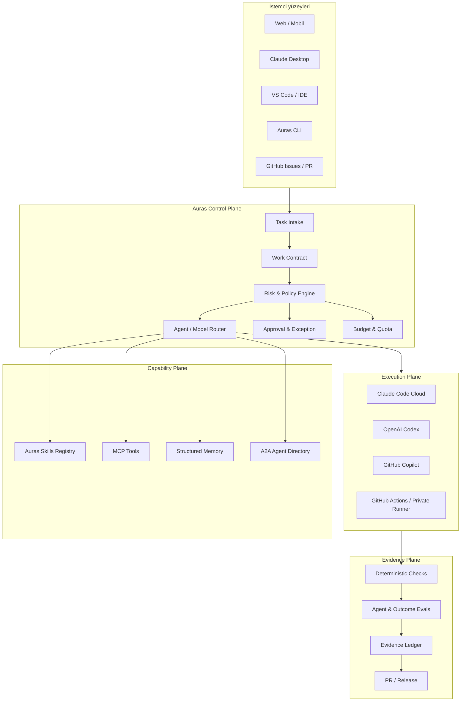

# AurasAgents

## Cloud-Native Agent Operating System — Ürün Vizyonu ve Hedef Mimari

**Belge durumu:** Tartışma taslağı  
**Sürüm:** 0.1  
**Tarih:** 23 Temmuz 2026  
**Amaç:** AurasAgents'in sıfırdan kurulacak ürün vizyonunu, tasarım ilkelerini, küresel ürünlerden çıkarılan dersleri, hedef mimariyi ve ilk geliştirme planını tanımlamak.

---

## 1. Yönetici özeti

AurasAgents, bir “AI sohbet ekranı”, bir “sanal çalışan görselleştirmesi” veya yalnızca kod yazan başka bir agent olmayacaktır.

AurasAgents'in hedefi:

> Bir insanın, herhangi bir cihazdan doğal dille iş tanımlayabildiği; uygun AI agent ve skill'lerin güvenli bulut ortamlarında çalıştığı; sonuçların bağımsız makine kanıtlarıyla doğrulandığı; tüm sürecin taşınabilir, denetlenebilir ve sağlayıcıdan bağımsız olduğu bir Agent Operating System kurmak.

Kullanıcı Claude Desktop, Claude Web, VS Code, terminal, GitHub veya mobil cihazdan aynı sistemi çağırabilmelidir. İşin yürütülmesi kullanıcının cihazına bağlı olmamalıdır. Kullanıcının bilgisayarı kapansa bile çalışma bulutta devam etmelidir.

AurasAgents ilk aşamada Claude-native, uzun vadede model-agnostic olacaktır:

- İlk çalışma motoru: Claude Code Cloud
- Kalıcı doğruluk kaynağı: GitHub
- Bağımsız doğrulama: GitHub Actions
- Taşınabilir uzmanlık formatı: Agent Skills
- Araç bağlantıları: MCP
- İleride agent-to-agent iletişimi: A2A
- Yerel cihazdaki yük: yalnızca tercih edilen istemci ve oturum bilgisi

Temel ürün kararı şudur:

> Claude, Codex veya başka bir model AurasAgents'in kendisi değildir. Bunlar AurasAgents tarafından kullanılabilen çalışma motorlarıdır.

---

## 2. Çözmek istediğimiz problem

Bugünkü AI agent ürünleri güçlüdür; fakat kullanıcı çoğunlukla aşağıdaki sorunları kendi başına çözmek zorundadır:

1. Her cihazda CLI, repository, bağımlılık ve secret kurulumu yapmak.
2. Farklı agent ürünlerinde aynı kuralları ve iş bilgisini tekrar tanımlamak.
3. Bir agent'ın “tamamlandı” demesiyle işin gerçekten doğru olduğunu ayırt edememek.
4. Hangi agent'ın hangi yetkiyle ne yaptığını takip edememek.
5. Sohbet geçmişi, yerel dosya ve farklı araçlar arasında parçalanmış hafıza kullanmak.
6. Agent sayısı arttıkça maliyet, izin, güvenlik ve koordinasyon karmaşası yaşamak.
7. Claude, Codex, Copilot veya başka bir sağlayıcıya gereğinden fazla bağımlı kalmak.
8. Otomasyon ile insan kontrolü arasında güvenilir bir sınır kuramamak.

AurasAgents bu problemleri tek bir ürün ilkesiyle çözecektir:

> İşi sohbet etrafında değil; sözleşme, yetki, kanıt ve sonuç etrafında organize et.

---

## 3. Ürün tezi

### 3.1 Ana tez

Geleceğin agent ürünü en fazla agent'a sahip olan ürün olmayacaktır. En güvenilir biçimde sonuç üreten, kanıt sunan ve farklı çalışma motorları arasında taşınabilen ürün olacaktır.

### 3.2 AurasAgents'in farklılaşma noktası

AurasAgents şu üç pazar katmanının kesişiminde duracaktır:

1. **Çalışan agent'lar:** Claude Code, Codex, Copilot, Cursor ve Jules gibi işi yapan ürünler.
2. **Agent runtime ve geliştirme platformları:** LangGraph/LangSmith ve OpenHands gibi agent oluşturma ve çalıştırma altyapıları.
3. **Kontrol ve yönetişim katmanları:** Microsoft Agent 365 gibi kimlik, envanter, izin ve denetim ürünleri.

AurasAgents bu ürünlerin tamamını yeniden üretmeye çalışmayacaktır. Bunların üzerine taşınabilir bir çalışma ve güven katmanı kuracaktır.

### 3.3 AurasAgents'in kategorisi

Önerilen kategori tanımı:

> **Portable Agent Operating System**

Alternatif kısa tanımlar:

- Cloud-native agent workforce control plane
- Evidence-driven agent operations platform
- Skills-first AI operating system
- One-person AI-native company operating system

---

## 4. Temiz sayfa kabulleri

Bu belge mevcut herhangi bir uygulamanın kodunu, ekranını veya rol modelini korumayı zorunlu kabul etmez.

Sıfırdan alınan kararlar:

- Yerel makine sistemin merkezi olmayacak.
- Sohbet geçmişi kalıcı doğruluk kaynağı olmayacak.
- Agent karakterleri ürünün ana veri modeli olmayacak.
- “Çok agent” başlı başına başarı ölçüsü olmayacak.
- Her görev için agent ekibi kurulmayacak.
- Dashboard, doğrulama motorundan önce yapılmayacak.
- Bir agent kendi başarısını tek başına onaylayamayacak.
- Kalıcı API anahtarı agent çalışma ortamına doğrudan verilmeyecek.
- Model sağlayıcısına özel bilgi, mümkün olduğu kadar taşınabilir skill ve policy katmanında tutulacak.
- Riskli işlemlerde tam otomasyon hedeflenmeyecek; doğru otomasyon seviyesi hedeflenecek.

---

## 5. Küresel araştırmadan çıkarılan dersler

### 5.1 McKinsey: agentic organization

McKinsey'nin “agentic organization” yaklaşımı organizasyonu insan, AI agent ve makinelerin beraber çalıştığı bir yapı olarak ele alıyor. Önerilen model fonksiyonel silolar yerine sonuç odaklı, küçük ve düz agentic takımlara dayanıyor. İnsanların her adımı yürütmek yerine sonucu yönlendirdiği, gerekli yerlerde doğrulama ve istisna yönetimi yaptığı “above the loop” yaklaşımı öne çıkıyor.

AurasAgents için alınacak ders:

- Agent'lar departman veya unvan taklidi yapmak yerine sonuca göre bir araya gelmeli.
- İş akışı, var olan insan sürecini hızlandırmakla kalmamalı; AI-first olarak yeniden tasarlanmalı.
- İnsan her küçük adımın içinde değil, hedef, risk, istisna ve yüksek etkili kararlarda bulunmalı.
- Teknoloji kadar operating model, yönetişim ve veri temeli önemlidir.

AurasAgents, “50 agent çalıştırmak” yerine “doğru sonucu en az koordinasyon maliyetiyle üretmek” üzerine kurulacaktır.

Kaynak: [McKinsey — The agentic organization](https://www.mckinsey.com/capabilities/people-and-organizational-performance/our-insights/the-agentic-organization-contours-of-the-next-paradigm-for-the-ai-era)

### 5.2 Microsoft Agent 365: kimlik merkezli kontrol

Microsoft Agent 365, farklı kaynaklardan gelen agent'ları ortak bir kontrol katmanında envanter, kimlik, güvenlik, veri koruma ve denetim politikalarıyla yönetmeyi hedefliyor.

AurasAgents için alınacak ders:

- Her agent çalışmasının ayrı ve izlenebilir bir kimliği olmalı.
- “Kullanıcı yetkiliyse agent da her şeye yetkilidir” yaklaşımı kullanılmamalı.
- Yetki, çalışma ve görev süresiyle sınırlı olmalı.
- Agent envanteri, sahiplik, izinler ve audit kayıtları birinci sınıf ürün nesneleri olmalı.

AurasAgents'in farkı, büyük Microsoft kurumsal paketini yeniden kurmak değil; aynı kimlik ve yönetişim disiplinini tek kişi ve küçük ekiplerin kullanabileceği sade bir ürüne indirmektir.

Kaynak: [Microsoft — Agent 365 overview](https://learn.microsoft.com/en-us/microsoft-agent-365/overview)

### 5.3 Claude Code: aynı motor, farklı yüzeyler

Claude Code; terminal, Desktop, VS Code, web, mobil, GitHub ve CI/CD yüzeylerinde aynı temel agent döngüsünü sunuyor. Cloud oturumları Anthropic tarafından yönetilen geçici makinelerde çalışabiliyor; repository içindeki `CLAUDE.md`, rules, skills, agents, commands ve MCP yapılandırmaları cloud oturumuna taşınabiliyor.

AurasAgents için alınacak ders:

- Arayüz ile çalışma motoru birbirinden ayrılmalı.
- Kullanıcı aynı sistemi istediği yüzeyden çağırabilmeli.
- Repository içindeki sürümlenmiş kurallar cloud ortamının yeniden kurulmasını sağlamalı.
- Geçici cloud runner varsayılan çalışma şekli olmalı.

AurasAgents Claude Code'u ilk ve en derin entegrasyon olarak kullanacak; fakat kalıcı ürün bilgisini sadece Claude'a özgü formatlara kilitlemeyecektir.

Kaynaklar:

- [Claude Code — Platforms and integrations](https://code.claude.com/docs/en/platforms)
- [Claude Code on the web](https://code.claude.com/docs/en/claude-code-on-the-web)
- [Claude Code Desktop](https://code.claude.com/docs/en/desktop-quickstart)

### 5.4 OpenAI Codex: güvenli cloud execution ve çoklu yüzey

Codex; uygulama, terminal, IDE, web, GitHub, SDK ve otomasyon yüzeylerini ortak bir hesap etrafında birleştiriyor. OpenAI'nin kendi güvenlik uygulamasında sandbox, ağ politikası, kısa ve kontrollü yetki, güvenli kimlik saklama, yönetilen kurallar ve agent-native telemetry temel yapı taşları olarak kullanılıyor.

AurasAgents için alınacak ders:

- Cloud çalıştırma varsayılan olarak sandbox içinde olmalı.
- Ağ erişimi varsayılan açık olmamalı.
- Düşük riskli eylemler akıcı, yüksek riskli eylemler açık onaylı olmalı.
- Agent'ın yaptığı her önemli eylem denetlenebilir telemetry üretmeli.
- Çalışma motoru SDK veya adapter üzerinden değiştirilebilir olmalı.

Kaynaklar:

- [OpenAI — Codex is generally available](https://openai.com/index/codex-now-generally-available/)
- [OpenAI — Running Codex safely](https://openai.com/index/running-codex-safely/)

### 5.5 GitHub Copilot: açık skill yaklaşımı

GitHub Copilot; custom agents, subagent'lar, hooks, MCP ve Agent Skills'i GitHub cloud agent, CLI ve IDE yüzeylerinde destekliyor. GitHub'ın `.agents/skills/`, `.claude/skills/` ve `.github/skills/` yollarını tanıması, skill'lerin tek ürüne özel olmaktan çıkmaya başladığını gösteriyor.

AurasAgents için alınacak ders:

- Uzmanlık “prompt arşivi” değil; sürümlenmiş skill paketi olmalı.
- Bir skill talimat, script, referans, asset, test ve eval içerebilmeli.
- Deterministik kontroller hook olarak agent muhakemesinden ayrılmalı.
- Skill'ler farklı agent istemcilerine adapte edilebilmeli.

Kaynaklar:

- [GitHub — About agent skills](https://docs.github.com/en/copilot/concepts/agents/about-agent-skills)
- [GitHub — Copilot customization](https://docs.github.com/en/copilot/reference/customization-cheat-sheet)

### 5.6 Cursor, Jules ve OpenHands: uzaktan görev devri

Cursor Background Agents ve Google Jules, repository'yi geçici cloud VM'e klonlayıp işi asenkron yürütüyor. Her ikisi de web üzerinden görev başlatma, GitHub entegrasyonu ve kullanıcı başka işle uğraşırken agent'ın çalışmaya devam etmesi yaklaşımını doğruluyor. OpenHands ise cloud ve self-hosted seçeneklerle model ve altyapı bağımsızlığına odaklanıyor.

AurasAgents için alınacak ders:

- “Görevi devret ve geri dön” temel kullanım şeklidir.
- Cloud ortamı repository tarafından yeniden üretilebilir olmalıdır.
- Plan, ilerleme, diff, test ve PR kullanıcıya görünmelidir.
- Uzun vadede hosted ve self-hosted runner seçenekleri desteklenmelidir.

Kaynaklar:

- [Cursor — Background Agents](https://docs.cursor.com/background-agent)
- [Google — Jules](https://jules.google/docs/)
- [OpenHands — Cloud coding agents](https://www.openhands.dev/)

### 5.7 LangGraph ve LangSmith: dayanıklı agent runtime

LangSmith Deployment; durable execution, task queue, state, streaming, human-in-the-loop, memory, webhooks, cron ve agent registry gibi üretim ihtiyaçlarını tek runtime altında topluyor.

AurasAgents için alınacak ders:

- Uzun süren işlerde checkpoint ve yeniden başlatma gerekir.
- Agent koşusu bir sohbet değil; yaşam döngüsü olan dayanıklı bir iştir.
- İzlenebilirlik, eval ve versiyonlama sonradan eklenen özellikler olmamalıdır.
- İlk sürümde bu altyapının tamamı yapılmamalı; ölçek gerektirdiğinde hazır bir runtime kullanılmalı veya eşdeğer sözleşmeler uygulanmalıdır.

Kaynak: [LangSmith Deployment](https://www.langchain.com/langsmith/deployment)

---

## 6. Rekabet haritası

| Çözüm | En güçlü olduğu alan | AurasAgents'in kopyalamayacağı alan | AurasAgents için fırsat |
|---|---|---|---|
| Claude Code | Güçlü coding agent, cloud ve çoklu yüzey | Kendi temel modelimizi yapmak | Claude'u ilk çalışma motoru olarak yönetmek |
| OpenAI Codex | Cloud/local geçişi, SDK, sandbox ve otomasyon | Başka bir Codex istemcisi yapmak | Aynı skill ve policy'yi Codex'e de taşıyabilmek |
| GitHub Copilot | GitHub-native agent, açık skill ve custom agent desteği | GitHub'ın tamamını yeniden yapmak | GitHub'ı kanıt ve değişiklik omurgası olarak kullanmak |
| Cursor | IDE deneyimi, background agent, web/mobile handoff | Yeni bir kod editörü yapmak | Editörden bağımsız görev ve kanıt katmanı sağlamak |
| Google Jules | Basit asenkron GitHub görevleri ve API | Yalnızca bug/feature agent olmak | Yazılım dışındaki skill ve iş akışlarını da kapsamak |
| OpenHands | Açık kaynak, self-hosted, model bağımsızlığı | İlk günden ağır self-host altyapısı | Regüle veya özel ortamlara kaçış yolu sunmak |
| LangSmith | Dayanıklı runtime, tracing, eval ve deployment | Tüm orchestration primitives'i yeniden yazmak | Gerektiğinde runtime sağlayıcısı olarak entegre etmek |
| Microsoft Agent 365 | Kurumsal kimlik, güvenlik ve envanter | E5 ölçeğinde kurumsal yönetim paketi | Aynı disiplini solo ve küçük ekip için sadeleştirmek |
| McKinsey yaklaşımı | Agentic operating model ve organizasyon tasarımı | Danışmanlık metodolojisini ürün sanmak | Outcome-aligned iş tasarımını ürünün çekirdeğine koymak |

### Pazardaki boşluk

Piyasa güçlü agent'lar ve güçlü kurumsal platformlar sunuyor. Fakat aşağıdaki birleşim hâlâ parçalı:

- Bir kişiye veya küçük takıma uygun sadelik
- Her cihazdan aynı sistemi çağırma
- Birden fazla model/agent sağlayıcısı
- Taşınabilir ve açık skill kütüphanesi
- Risk tabanlı otomasyon
- Makine doğrulamalı sonuç
- Agent kimliği ve yetki sınırı
- Kalıcı, sürümlenmiş organizasyon hafızası
- Kod ve kod dışı iş akışlarının aynı operating model altında toplanması

AurasAgents bu birleşimi hedefleyecektir.

---

## 7. Tasarım ilkeleri

### 7.1 Cloud-first, local-optional

Varsayılan çalışma cloud'da yapılır. Yerel çalıştırma, özel dosya veya düşük gecikme gerektiren durumlar için isteğe bağlıdır.

### 7.2 Surface-agnostic

Web, Desktop, VS Code, terminal, GitHub ve mobil yalnızca farklı istemcilerdir. Görev, policy, skill ve kanıt modeli aynıdır.

### 7.3 Skills-first

Agent'lar kalıcı uzman kişiler olarak değil, bir işi tamamlamak için skill kullanan çalışma süreçleri olarak ele alınır.

### 7.4 Outcome-aligned

İş “backend agent'a görev ver” şeklinde değil, “bu sonucu şu kabul kriterleriyle üret” şeklinde tanımlanır.

### 7.5 Evidence over assertion

Agent'ın “başarılı” demesi kanıt değildir. Başarı, bağımsız kontrollerden ve doğrulanabilir artifact'lardan türetilir.

### 7.6 Least privilege

Her koşu yalnızca ihtiyacı olan repository, araç, veri ve ağ hedeflerine erişir. Yetki koşu sonunda sona erer.

### 7.7 Open standards first

Skill için Agent Skills, araçlar için MCP, agent iletişimi için A2A ve telemetry için OpenTelemetry gibi açık standartlar tercih edilir.

### 7.8 Model-agnostic, quality-aware

Her model her iş için eşit kabul edilmez. Model seçimi kalite, risk, hız ve maliyet politikasına göre yapılır.

### 7.9 Human above the loop

İnsan her adımı onaylamaz. Hedefleri, politikaları, yüksek riskli kararları ve istisnaları yönetir.

### 7.10 No hidden local dependency

Bir işin çalışması tek bir laptop'taki dosya, credential, daemon veya kuruluma bağlı olamaz.

---

## 8. Kullanıcı deneyimi

### 8.1 Temel komut

Kullanıcı hangi yüzeyde olursa olsun aynı niyeti ifade eder:

```text
/auras ödeme akışındaki hatayı araştır, güvenli düzeltmeyi hazırla ve kanıtlı PR aç
```

Örnek terminal kullanımı:

```bash
auras run --project payments "Abonelik iptalindeki yarış koşulunu düzelt"
```

Örnek GitHub kullanımı:

```text
@auras bu issue'yu analiz et, planı çıkar ve düşük riskliyse PR hazırla
```

### 8.2 X cihazında ne bulunur?

| Yüzey | Cihazda bulunan |
|---|---|
| Web | Tarayıcı ve güvenli oturum |
| Mobil | Uygulama/PWA ve güvenli oturum |
| Claude Desktop | Claude uygulaması ve giriş bilgisi |
| VS Code | İnce AurasAgents/Claude eklentisi ve giriş bilgisi |
| Terminal | Tek bir küçük `auras` istemcisi ve giriş bilgisi |

Cihazda bulunması gerekmeyenler:

- Repository clone
- Proje bağımlılıkları
- API secret'ları
- Veritabanı
- Agent runtime
- Docker ortamı
- Kalıcı iş state'i

### 8.3 Cloud tarafında ne olur?

1. Kullanıcı kimliği doğrulanır.
2. Proje ve görev sözleşmesi çözülür.
3. Risk sınıfı hesaplanır.
4. Uygun çalışma motoru seçilir.
5. Geçici sandbox oluşturulur.
6. Repository doğru commit'ten klonlanır.
7. Gerekli skill ve policy'ler yüklenir.
8. Kısa ömürlü yetkiler verilir.
9. Agent işi yürütür.
10. Bağımsız doğrulamalar çalışır.
11. Kanıt paketi ve gerekiyorsa PR oluşturulur.
12. Geçici çalışma ortamı silinir.

---

## 9. Hedef mimari



### 9.1 Interface plane

Görev başlatma, takip, yönlendirme, onay ve sonuç inceleme yüzeyidir. İş mantığı istemciye gömülmez.

### 9.2 Control plane

AurasAgents'in gerçek çekirdeğidir:

- Görev alma ve normalleştirme
- Work Contract oluşturma
- Risk sınıflandırma
- Policy uygulama
- Model ve agent seçme
- Bütçe ve limit yönetimi
- İnsan onayı ve istisna akışı
- Koşu yaşam döngüsü

### 9.3 Capability plane

Agent'ların işi nasıl yapacağını ve hangi araçlara ulaşacağını tanımlar:

- Skills
- MCP araçları
- Kurumsal/proje hafızası
- Şablonlar ve referanslar
- İleride A2A agent kayıtları

### 9.4 Execution plane

İşin gerçekten çalıştığı geçici ortamdır. İlk adapter Claude Code Cloud olacaktır. Sonraki adapter'lar aynı Work Contract üzerinden Codex, Copilot, Jules, OpenHands veya özel runner'lara iş verebilir.

### 9.5 Evidence plane

Agent beyanını doğrulanmış sonuca dönüştürür:

- Test, lint, build ve typecheck
- Security ve dependency taramaları
- UI screenshot/video
- API contract testi
- Performance kontrolü
- Eval sonucu
- Artifact hash
- Commit ve çalışma session bağlantısı
- Approval kayıtları

---

## 10. Ana ürün nesneleri

### 10.1 Project

Bir repository veya ilişkili repository grubunu, ortamları ve politikaları temsil eder.

### 10.2 Work Contract

Bir görevin yürütülebilir sözleşmesidir.

Örnek:

```yaml
id: work_01
project: payments
objective: "Abonelik iptalindeki yarış koşulunu düzelt"
requested_by: user_01
source:
  type: cli
  ref: "session-url"
scope:
  repositories:
    - owner/payments-api
  allowed_paths:
    - src/subscriptions/**
    - tests/subscriptions/**
acceptance:
  - "Aynı abonelik iki kez iptal edilemez"
  - "Mevcut API sözleşmesi bozulmaz"
required_evidence:
  - unit_tests
  - integration_tests
  - concurrency_reproduction
risk:
  proposed_tier: R2
constraints:
  max_cost_usd: 15
  max_duration_minutes: 60
  network_policy: restricted
delivery:
  mode: pull_request
```

### 10.3 Skill

Tekrarlanabilir uzmanlık paketidir. En az bir `SKILL.md` içerir; isteğe bağlı script, referans ve asset barındırır.

### 10.4 Agent Run

Belirli Work Contract, model, skill sürümleri, yetkiler ve environment ile yapılan tek çalışma denemesidir.

### 10.5 Evidence

Bir iddiayı doğrulayan, kaynağı ve bütünlüğü bilinen makine çıktısıdır.

### 10.6 Decision

İnsan veya policy engine tarafından verilen, gerekçesi ve kapsamı kayıtlı karardır.

### 10.7 Memory

Gelecekteki işleri iyileştirmek için saklanan yapılandırılmış ve yaşam döngüsü yönetilen bilgidir.

---

## 11. Auras Skills

### 11.1 Amaç

Auras Skills, ürünün en kalıcı değer katmanı olacaktır. Modeller değişse bile şirketin işi nasıl yaptığı skill'lerde kalacaktır.

### 11.2 Açık standarda uyum

Temel format Agent Skills standardına uyacaktır:

```text
.agents/skills/
└── secure-api-change/
    ├── SKILL.md
    ├── scripts/
    ├── references/
    ├── assets/
    └── tests/
```

Agent Skills standardı, `SKILL.md` ile birlikte script, referans ve asset içeren taşınabilir bir paket tanımlar. AurasAgents bu standardı genişletmeden önce standardın doğal alanlarını kullanacaktır.

Kaynaklar:

- [Agent Skills overview](https://agentskills.io/home)
- [Agent Skills specification](https://agentskills.io/specification)

### 11.3 Auras ek sözleşmesi

Standardın üzerine ayrı bir `auras.skill.yaml` dosyası eklenebilir:

```yaml
schema_version: 1
skill: secure-api-change
version: 1.2.0
capabilities:
  - code.modify
  - test.execute
permissions:
  filesystem: workspace
  network:
    mode: allowlist
    domains:
      - api.github.com
required_evidence:
  - unit_tests
  - api_contract
supported_engines:
  - claude-code
  - codex
evals:
  dataset: evals/cases.yaml
  minimum_score: 0.90
```

### 11.4 Skill yaşam döngüsü

```text
Taslak → İnceleme → Eval → Yayın → Gözlem → İyileştirme → Emeklilik
```

Her skill için takip edilecek ölçüler:

- Aktivasyon doğruluğu
- Tamamlanan iş oranı
- Kanıtlı başarı oranı
- Yanlış pozitif/negatif sonuç
- Maliyet
- Süre
- Geri alma veya üretim hatası oranı
- Skillsiz baseline'a göre kalite artışı

### 11.5 Client adapter'ları

Tek kaynak `.agents/skills/` olacaktır. Build/sync katmanı gerektiğinde şu ürün yollarını üretecektir:

- Claude: `.claude/skills/`
- GitHub Copilot: `.github/skills/` veya `.agents/skills/`
- Codex ve diğer uyumlu istemciler: desteklenen yerel format

Bu sayede aynı skill farklı agent ürünlerinde çalıştırılabilir.

### 11.6 Skill, MCP, policy ve eval ayrımı

AurasAgents çok sayıda skill ve MCP bağlantısını rastgele yükleyen bir sistem olmayacaktır. Dört kavram kesin olarak ayrılmalıdır:

| Katman | Soru | Örnek |
|---|---|---|
| Skill | Bu işi nasıl yapmalıyım? | Güvenli API değişikliği, PR review, incident triage |
| MCP | Hangi araca veya veriye erişmeliyim? | GitHub, browser, CI, docs, observability, cloud deploy |
| Policy | Buna izin var mı? | Network allowlist, secret erişimi, production yasağı |
| Eval | Doğru yaptığımı nasıl ölçeceğim? | Test, benchmark, kalite skoru, regression case |

Bu ayrım yoksa sistem büyüdükçe karar kalitesi düşer. Çok skill olması tek başına değer değildir; asıl değer doğru capability'nin doğru risk seviyesinde seçilmesidir.

### 11.7 Capability Resolver

AurasAgents'in merkezinde bir Capability Resolver bulunacaktır. Görevi, kullanıcının niyetinden uygun skill, MCP, model, runner ve doğrulama planını seçmektir.

Resolver akışı:

1. Kullanıcı isteğinden iş hedefi, çıktı türü ve risk seviyesi çıkarılır.
2. Skill Registry'den yalnızca ilgili 5-10 aday capability aranır.
3. Adaylar policy ile filtrelenir.
4. Mevcut olmayan veya yetkisiz MCP bağlantıları elenir.
5. Adaylar geçmiş eval performansı, maliyet, süre ve risk uyumuna göre sıralanır.
6. Seçilen skill tam içerik olarak yüklenir.
7. Gerekli MCP araçları görev sırasında ihtiyaç oldukça çağrılır.
8. İş bağımsız kanıtlarla doğrulanır.
9. Başarısızlıkta policy'nin izin verdiği alternatif skill, model veya runner denenir.

Progressive disclosure zorunludur: agent tüm skill arşivini context'e doldurmaz. Önce yalnızca registry metadata'sı görülür; tam `SKILL.md` sadece seçilen capability için yüklenir.

### 11.8 Başlangıç skill seti

İlk sürümde yüzlerce skill yerine az sayıda, yüksek kaliteli çekirdek skill tercih edilmelidir:

1. `project-onboarding`
2. `task-contract`
3. `research-with-evidence`
4. `implementation-planning`
5. `implement-change`
6. `test-and-verify`
7. `security-review`
8. `pull-request-review`
9. `incident-triage`
10. `skill-authoring-and-evaluation`

Bu set, yazılım geliştirme dışındaki araştırma, operasyon, finans ve müşteri süreçlerine genişletilebilir; fakat yeni skill ancak ölçülebilir kullanım ve eval ihtiyacı varsa eklenmelidir.

### 11.9 MCP başlangıç seti

İlk MCP bağlantıları işin kanıtlanabilir ve bulutta yürütülebilir olmasına hizmet etmelidir:

- GitHub
- Web araştırma
- Browser / Playwright
- Dokümantasyon arama
- CI sonuçları
- Observability ve log kaynakları
- Cloud deployment

Her MCP bağlantısı capability metadata'sında tanımlanan izinlerle kullanılmalıdır. Bir skill'in bir MCP'ye ihtiyacı olması, o MCP'nin otomatik olarak sınırsız yetki alacağı anlamına gelmez.

### 11.10 Güvenli kendi kendini iyileştirme

AurasAgents model ağırlıklarını kendi kendine değiştirmeyecektir. Buna rağmen sistem kontrollü biçimde kendini iyileştirebilir:

```text
Run logları → hata deseni → skill taslağı veya değişikliği → eval karşılaştırması → güvenlik kontrolü → insan onayı veya canary yayın → izleme ve rollback
```

Otomatik yapılabilecekler:

- Başarısız run'lardan tekrar eden hata desenlerini sınıflandırmak
- Skill iyileştirme taslağı hazırlamak
- Yeni eval case önermek
- Eski veya çelişkili memory kayıtlarını işaretlemek
- Skill, model ve MCP performansını karşılaştırmak
- Düşük performanslı capability'leri karantinaya önermek

Otomatik yapılmaması gerekenler:

- Kendi yetkisini yükseltmek
- Security policy değiştirmek
- Production secret veya geniş veri erişimi açmak
- Eval geçmeden skill yayınlamak
- Kendi ürettiği testi tek kanıt kabul etmek
- Kritik memory bilgisini doğrulamasız kalıcılaştırmak

Temel kural: Sistem öğrenebilir, ama kendi güvenlik sınırlarını tek başına genişletemez.

---

## 12. Risk ve otomasyon modeli

| Seviye | Örnek | Varsayılan davranış |
|---|---|---|
| R0 — Read only | Araştırma, açıklama, log inceleme | Tam otomatik |
| R1 — Düşük | Doküman, test, küçük refactor | Otomatik çalışma ve PR |
| R2 — Orta | Uygulama kodu, dependency güncelleme | Zorunlu CI ve kanıt; policy uygunsa merge |
| R3 — Yüksek | Auth, ödeme, veri migration, permission | İnsan onayı ve kontrollü release |
| R4 — Kritik | Veri silme, production secret, geniş yetki | Varsayılan engelleme; özel yetki gerekir |

Risk sınıfı yalnızca prompt'tan çıkarılmaz. Aşağıdaki sinyaller birlikte değerlendirilir:

- Değişen dosyalar
- Veri ve migration etkisi
- Kimlik/yetki alanları
- İnternet ve secret ihtiyacı
- Production etkisi
- Değişikliğin geri alınabilirliği
- Blast radius
- Test kapsamı
- Model ve skill geçmiş performansı

### Temel kural

> Otomasyon seviyesi agent'ın ne kadar ikna edici olduğuna değil, ölçülen riske ve üretilen kanıta göre belirlenir.

---

## 13. Evidence Ledger

Evidence Ledger, AurasAgents'in ana güven mekanizmasıdır.

Her önemli iddia kanıt referansı taşımalıdır:

```yaml
claim: "Abonelik iptali artık idempotent"
evidence:
  - type: test
    name: concurrency_integration_test
    source: github-actions
    run_id: "123456"
    commit_sha: "abc123"
    status: passed
  - type: artifact
    name: test-report
    sha256: "..."
```

### Kanıt güven seviyeleri

1. **Agent assertion:** Agent'ın metin beyanı; tek başına yeterli değildir.
2. **Agent-produced evidence:** Agent'ın çalıştırdığı test veya oluşturduğu çıktı.
3. **Independent CI evidence:** Ayrı ortamda çalışan kontrol.
4. **Environment evidence:** Staging/production telemetry veya sentetik test.
5. **Human decision:** Yüksek riskli sonuç için bilinçli onay.

Merge ve release politikası, ihtiyaç duyulan minimum kanıt seviyesini risk sınıfına göre belirler.

---

## 14. Hafıza modeli

AurasAgents sohbet geçmişini kalıcı hafıza olarak kabul etmez.

### 14.1 Hafıza katmanları

| Katman | İçerik | Saklama |
|---|---|---|
| Session | O anki görev konuşması ve geçici bağlam | Agent sağlayıcısı / kısa süre |
| Run | Plan, eylem, tool kullanımı ve sonuçlar | Evidence store |
| Project | Mimari, komutlar, politikalar, kararlar | Git |
| Organization | Ortak skill, politika ve tercih | Merkezi registry + Git |
| Learning | Başarı/başarısızlıktan çıkarılan doğrulanmış ders | İnceleme sonrası sürümlü kayıt |

### 14.2 Hafıza kalitesi

Her kalıcı hafıza kaydı şunları taşımalıdır:

- Kaynak
- Oluşturulma tarihi
- Kapsam
- Güven seviyesi
- Son kullanım tarihi
- Son kullanma veya yeniden doğrulama tarihi
- Çeliştiği kayıtlar
- İnsan/CI tarafından doğrulanma durumu

### 14.3 Unutma

Hafızaya eklemek kadar unutmak da ürün özelliğidir. Eski, yanlış, hassas veya artık geçerli olmayan bilgi kontrollü biçimde emekliye ayrılmalıdır.

---

## 15. Güvenlik modeli

AurasAgents aşağıdaki minimum güvenlik kurallarını uygular:

1. Her run için ayrı kimlik.
2. Kısa ömürlü ve görev kapsamlı token.
3. Secret'ların prompt, log ve repository'ye yazılmasını önleme.
4. Varsayılan kapalı veya allowlist ağ erişimi.
5. Ephemeral ve izole filesystem.
6. Tool bazında izin.
7. Hassas işlemlerde iki aşamalı karar.
8. Prompt injection'a karşı güven sınırları.
9. Tüm dış eylemler için audit trail.
10. Run durdurma ve yetki iptal mekanizması.
11. Model çıktısından bağımsız deterministik policy enforcement.
12. Üçüncü taraf skill ve MCP paketleri için güven/izin incelemesi.

OWASP, multi-agent sistemlerin reasoning, memory, tool, identity, oversight ve agent-to-agent etkileşimlerinde yeni saldırı yüzeyleri oluşturduğunu vurguluyor. AurasAgents threat model'i ilk MVP ile birlikte hazırlanacaktır.

Kaynaklar:

- [OWASP — Multi-Agentic System Threat Modeling Guide](https://genai.owasp.org/resource/multi-agentic-system-threat-modeling-guide-v1-0/)
- [NIST — AI Risk Management Framework](https://www.nist.gov/itl/ai-risk-management-framework)

---

## 16. Açık protokoller

### Agent Skills

Uzmanlığın farklı istemciler arasında taşınmasını sağlar.

### MCP

Agent'ın API, veri kaynağı ve araçlarla standart biçimde çalışmasını sağlar.

### A2A

Farklı sistem ve sağlayıcılardaki agent'ların birbirini keşfetmesi, görev alışverişi yapması ve sonuç iletmesi için kullanılacaktır. İlk MVP'de gerekli değildir; ürün sözleşmeleri ileride A2A adapter'ı eklenebilecek biçimde tasarlanacaktır.

Google'ın başlattığı A2A protokolünün Linux Foundation'a devredilmesi ve çok sayıda büyük sağlayıcı tarafından desteklenmesi, agent iletişiminde sağlayıcı bağımsız standardın stratejik önemini gösteriyor.

Kaynak: [Google — A2A donated to the Linux Foundation](https://developers.googleblog.com/google-cloud-donates-a2a-to-linux-foundation/)

### OpenTelemetry

Run, tool call, latency, hata ve maliyet olaylarının sağlayıcıdan bağımsız izlenmesi için tercih edilecektir.

---

## 17. MVP kapsamı

İlk ürün bütün hedef mimariyi kurmayacaktır. En küçük güvenilir çekirdek yapılacaktır.

### MVP'de olacaklar

- GitHub ile kimlik ve repository bağlantısı
- Claude Code Cloud adapter'ı
- Web/Claude üzerinden görev başlatma
- İnce `auras` terminal istemcisi
- Work Contract üretimi
- R0–R3 risk sınıflandırması
- Agent Skills registry
- Skill validation ve temel eval
- GitHub Actions doğrulaması
- Evidence Ledger'ın GitHub tabanlı ilk sürümü
- PR oluşturma ve session provenance
- Maliyet/süre limiti
- Yüksek riskli işlerde onay
- Run sonucu ve özet raporu

### MVP'de olmayacaklar

- Sanal ofis ve karakter animasyonları
- Kendi foundation model'imiz
- Genel amaçlı workflow canvas
- 50–100 agent swarm
- Enterprise HR/ERP özellikleri
- Kendi CI platformumuz
- Kendi source control sistemimiz
- Ağır self-hosted Kubernetes altyapısı
- Her model sağlayıcısı için ilk günden destek
- Production'a sınırsız otomatik erişim

---

## 18. İlk teknik kurgu

### 18.1 Repository yapısı

```text
aurasagents/
├── README.md
├── AGENTS.md
├── CLAUDE.md
├── docs/
│   ├── vision.md
│   ├── architecture.md
│   ├── security-model.md
│   └── decisions/
├── schemas/
│   ├── work-contract.schema.json
│   ├── evidence.schema.json
│   └── project.schema.json
├── .agents/
│   └── skills/
├── adapters/
│   ├── claude-code/
│   ├── github/
│   └── github-actions/
├── policy/
│   ├── risk/
│   ├── permissions/
│   └── release/
├── cli/
├── control-plane/
├── evals/
└── .github/
    └── workflows/
```

### 18.2 İlk aşamada satın al/kullan

- Cloud agent runtime: Claude Code Cloud
- Source of truth: GitHub
- CI: GitHub Actions
- Authentication: GitHub/Claude OAuth
- Secret saklama: GitHub veya seçilen cloud secret manager
- Artifact saklama: GitHub Actions artifacts
- İlk audit görünümü: GitHub PR/check/run kayıtları

### 18.3 İlk aşamada kendimiz yap

- Work Contract
- Risk ve policy modeli
- Skills registry ve adapter mantığı
- Evidence normalizasyonu
- Model/agent routing sözleşmesi
- Auras CLI
- Cross-surface task kimliği
- Öğrenme ve eval modeli

### 18.4 Daha sonra değerlendir

- Kalıcı control-plane veritabanı
- Özel web dashboard/PWA
- LangSmith veya benzer durable runtime
- Codex/Copilot/Jules/OpenHands adapter'ları
- Organization-level agent identity
- A2A directory
- Self-hosted runner
- Object storage

---

## 19. Geliştirme aşamaları

### Aşama 0 — Ürün sözleşmesi

Çıktılar:

- Vizyonun onaylanması
- Hedef kullanıcı ve ilk üç iş akışının seçilmesi
- Work Contract şeması
- Risk sınıfları
- Evidence sözleşmesi
- Güvenlik threat model
- Teknik karar kayıtları

Başarı ölçütü:

> Aynı görev iki farklı kişi veya model tarafından okunduğunda kapsam, risk ve başarı kriterleri aynı anlaşılabiliyor.

### Aşama 1 — Claude-native çekirdek

Çıktılar:

- AurasAgents Claude plugin/skills paketi
- Claude Code Cloud ortamı
- GitHub bağlantısı
- `/auras` komutu
- İlk üç production-quality skill
- PR ve CI akışı

Başarı ölçütü:

> Yeni bir cihazdan yalnızca giriş yaparak görev başlatılabiliyor ve doğrulanmış PR alınabiliyor.

### Aşama 2 — Evidence ve policy

Çıktılar:

- Risk motoru
- Evidence Ledger
- Required checks
- Approval akışları
- Cost/time limits
- Run provenance

Başarı ölçütü:

> Agent'ın başarı beyanı ile bağımsız doğrulama teknik olarak ayrılmış durumda.

### Aşama 3 — Taşınabilirlik

Çıktılar:

- Canonical `.agents/skills/`
- Claude/GitHub/Codex adapter üretimi
- İkinci çalışma motoru
- Model karşılaştırmalı eval

Başarı ölçütü:

> Aynı Work Contract ve skill, en az iki farklı çalışma motorunda ölçülebilir biçimde çalışıyor.

### Aşama 4 — Cloud control plane

Çıktılar:

- Merkezi run ve project API
- Web/PWA
- Notification
- Durable task state
- Managed secret ve identity
- Cross-device handoff

Başarı ölçütü:

> Kullanıcının cihazı kapansa veya değişse bile görev, karar ve kanıt kaybolmuyor.

### Aşama 5 — Agentic company workflows

Çıktılar:

- Araştırma, ürün, finans, operasyon ve müşteri süreçleri için skill paketleri
- Outcome-aligned workflow'lar
- A2A entegrasyonu
- Çoklu repository ve çoklu proje yönetimi

Başarı ölçütü:

> AurasAgents yalnızca kod üretmiyor; ölçülebilir bir iş sonucunu uçtan uca yönetebiliyor.

---

## 20. İlk üç referans iş akışı

### 20.1 Kanıtlı yazılım değişikliği

İstek → plan → risk → kod → test → security → PR → kanıt → merge/release.

### 20.2 Araştırmadan karara

Araştırma sorusu → kaynak toplama → doğrulama → karşılaştırma → öneri → karar kaydı → takip görevi.

### 20.3 Production olayına müdahale

Alert → log/metric inceleme → hipotez → yeniden üretim → güvenli patch → test → onay → canary → izleme → postmortem hafızası.

Bu üç akış; yazılım, bilgi çalışması ve operasyon olmak üzere ürünün ana yeteneklerini sınar.

---

## 21. Başarı metrikleri

Aşağıdakiler ana metrik olmayacaktır:

- Agent sayısı
- Üretilen token
- Yazılan kod satırı
- Açılan görev sayısı
- “Tamamlandı” mesajı sayısı

Ana metrikler:

| Metrik | Tanım |
|---|---|
| Verified Outcome Rate | Bağımsız kanıtla kabul edilen işlerin oranı |
| First-pass Acceptance | İlk teslimde kabul edilen sonuç oranı |
| Time to Evidence | İstekten güvenilir kanıta kadar geçen süre |
| Cost per Accepted Outcome | Kabul edilen sonuç başına toplam model/compute maliyeti |
| Human Interruption Load | Sonuç başına insan müdahalesi sayısı ve süresi |
| Escape Rate | Kontrollerden geçen fakat sonradan hata üreten iş oranı |
| Rollback Rate | Geri alınan değişiklik oranı |
| Skill Lift | Skill kullanılan koşunun baseline'a göre kalite artışı |
| Permission Exceptions | Normal policy dışına çıkan yetki talebi oranı |
| Memory Correction Rate | Sonradan yanlış veya eski bulunan hafıza oranı |

---

## 22. Ürün ilkeleri olarak kesin kararlar

1. AurasAgents bir model değildir.
2. AurasAgents bir dashboard değildir.
3. AurasAgents bir karakter simülasyonu değildir.
4. AurasAgents'in kalıcı değeri skill, policy, evidence ve memory katmanındadır.
5. Claude ilk çalışma motorudur; tek zorunlu çalışma motoru değildir.
6. GitHub ilk doğruluk kaynağıdır; sohbet geçmişi değildir.
7. Cloud varsayılandır; local isteğe bağlıdır.
8. Düşük risk otomatik, yüksek risk kontrollüdür.
9. Agent kendi işini tek başına onaylayamaz.
10. Her çalışma kimlikli, sınırlı, gözlemlenebilir ve durdurulabilir olmalıdır.
11. Açık standart mümkünse özel formatın önüne geçer.
12. Yeni altyapı yalnızca ürün değerini kanıtlayan ihtiyaç ortaya çıktığında eklenir.

---

## 23. Açık sorular

Bu kararlar uygulamadan önce tartışılmalıdır:

1. İlk hedef kullanıcı yalnız kurucu mu, küçük ekip mi, yoksa enterprise mı?
2. İlk üç production skill tam olarak hangileri olmalı?
3. AurasAgents yalnız mühendislikten mi başlamalı, yoksa araştırma/operasyon da MVP'ye girmeli mi?
4. Claude Max aboneliği ile kullanıcı tarafından başlatılan işler ve Anthropic API ile insansız otomasyon nasıl ayrılmalı?
5. GitHub Issues Work Contract'ın kullanıcı arayüzü olabilir mi?
6. Evidence Ledger ilk sürümde GitHub Checks ve artifact'larla yeterli olur mu?
7. İkinci çalışma motoru Codex mi, Copilot mu olmalı?
8. Canonical skill kaynağı `.agents/skills/` olarak belirlenmeli mi?
9. Özel control plane hangi kullanım eşiğinde yapılmalı?
10. Hangi işlemler hiçbir koşulda otomatik production yetkisi almamalı?
11. AurasAgents private/internal ürün mü, açık kaynak çekirdek + ticari cloud mu olmalı?
12. Skill marketplace hedeflenmeli mi, yoksa uzun süre curated/private registry mi kalmalı?

---

## 24. Claude ile tartışma prompt'u

Aşağıdaki prompt bu belgeyle birlikte Claude'a verilebilir:

```text
Bu belge AurasAgents adlı sıfırdan tasarlanan cloud-native bir Agent Operating
System için ürün vizyonudur.

Lütfen belgeyi savunmaya çalışma. Principal product architect, agent systems
researcher ve security reviewer gibi eleştirel incele.

Şunları yap:

1. Ürün tezindeki en güçlü ve en zayıf varsayımları ayır.
2. AurasAgents'in mevcut Claude Code, Codex, GitHub Copilot, Cursor, Jules,
   LangSmith ve Microsoft Agent 365 yetenekleri tarafından kolayca
   metalaştırılabilecek bölümlerini göster.
3. Gerçek ve savunulabilir farklılaşma noktalarını belirle.
4. Gereksiz altyapı ve erken soyutlama risklerini işaretle.
5. Güvenlik, identity, secret, prompt injection, supply-chain ve evidence
   modelindeki açıkları bul.
6. MVP kapsamını yarıya indir; fakat temel ürün tezini koru.
7. İlk 90 günlük deney ve ölçüm planını öner.
8. Hangi varsayımlar doğrulanmadan control plane veya özel dashboard
   yapılmaması gerektiğini açıkça yaz.
9. Sonunda şu kararlardan birini ver ve gerekçelendir:
   - devam et,
   - daraltarak devam et,
   - farklı konumlandır,
   - yapma.

Yanıtında genel AI tavsiyeleri verme. Belgedeki somut mimari ve ürün
kararlarına referans ver.
```

---

## 25. Nihai hedef

AurasAgents başarıya ulaştığında kullanıcı şu deneyimi yaşamalıdır:

> “Hangi bilgisayarda olduğumu, hangi agent'ın çalışacağını, ortamın nasıl
> kurulacağını ve testlerin nerede koşacağını düşünmüyorum. İstediğim sonucu,
> sınırları ve kabul kriterlerini söylüyorum. AurasAgents doğru skill ve çalışma
> motorunu seçiyor, işi güvenli bir cloud ortamında yürütüyor ve bana yalnızca
> doğrulanmış sonuçları, kanıtları ve gerçekten gerekli kararları getiriyor.”

Bu deneyim AurasAgents'in kuzey yıldızıdır.
